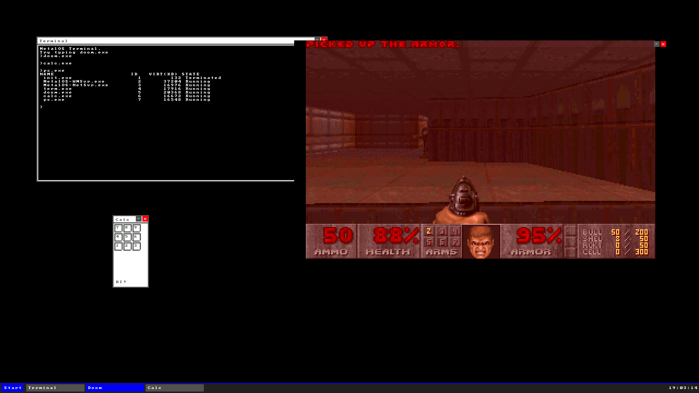

# MetalOS

## Introduction
MetalOS is homebrew operating system for x86-64. It is 64-bit only and has only been tested in Hyper-V Gen2.

## Building
1. Open solution file in VS and build all or open VS 2022 Native x64 command promot and run ``.\scripts\build_solution.cmd``
2. Run ``.\scripts\build_vhd.cmd`` to build ``.\out\MetalOS.vhdx``
3. Create a new VM in ``Hyper-V Manager``, Gen2, reference the build ``vhdx``, disable secure boot.
4. Turn on Com ports:
```
Get-VMComPort -VMName MetalOS
Set-VMComPort -VMName MetalOS -Path \\.\pipe\metalos_com1 -Number 1 
Set-VMComPort -VMName MetalOS -Path \\.\pipe\metalos_com2 -Number 2 
Get-VMComPort -VMName MetalOS
```
5. If theres a weird access error fix ``icacls`` in ``.\scripts\build_vhd.cmd``


### Project Goals
* Run DOOM!
* 48-bit canonical virtual address space (not identity paging)
  * Low half used for Usermode
  * High half used for Kernel mode
* Ring 0 (Kernel) and Ring 3 (User)
* Modern systemcall interface (syscall instruction)
* Window Manager
* Network stack
* UEFI runtime services

### Non-Goals
* 32-bit compatibility
* Additional architectures
* Support for bios

## Architecture
MetalOS is a hybrid kernel that uses a custom UEFI bootloader:
* Kernel provides page tables, virtual memory, processes and threads
* Usermode server for window manager and network stack.

Note: All executable formats (``Kernel``, ``Doom``, ``Runtime``, and even ``Boot``) are Microsoft PE files. Boot contains a loader for the Kernel, the Kernel contains a loader for the usermode process (as well as the Runtime) and the Runtime contains a loader for subsequent DLLs the usermode process may desire.

### Features
* Kernel Call Stack (virtual unwind + PDB support) for Assertions/Bugchecks

    IP: 0xffff8000010122c6 Function: ?Bugcheck@Kernel@@QEAAXPEBD00@Z Line: 395  
    IP: 0xffff800001017b3c Function: ?SetScreenBuffer@Kernel@@QEAA?AW4SystemCallResult@@PEAX@Z Line: 173  
    IP: 0xffff800001015383 Function: ?Syscall@Kernel@@QEAA_KPEAUSystemcallFrame@@@Z Line: 899  
    IP: 0xffff80000102e87f Function: SYSTEMCALL_HANDLER Line: 56  
    IP: 0xffff800001039c9c Function: x64_SYSTEMCALL Line: 50  
* Kernel debugging using WinDbg

### 3rd Party code
* uACPI
* Virtual Stack Unwinder from coreclr
* kvprintf
* kdcom - ReactOS

### Hyper-V Notes
Gen2 Hyper-V was chosen early into development for its 64-bit UEFI environment (versus the real mode bios booting of Gen1). Gen1 VMs use emulated legacy hardware which allows it to run most operating systems without any modification. However, Gen2 VMs use all synthetic hardware, which requires using the VMBus for access, an entirely undocumented protocol (Guests are required to be aware of Hyper-Vs existence). Drivers used in MetalOS relied heavily on looking at linux driver source (drivers that were written by Microsoft).

- [x] VMBus
- [x] Keyboard
- [x] Mouse (Basics)
- [x] Video Adapter
- [ ] SCSI
- [x] Network

## Screenshots

### Doom


### Window System


### WinDBG

Connect with:
```
\\.\pipe\metalos_com2
```
May need to set sympath force kernel symbol:
```
.reload /f /i moskrnl.exe=0xffff800001000000
dx -r1 (*((moskrnl!Kernel *)0xffff8000011cf030))
```

Viewing stack trace:
```
kd> k
 # Child-SP          RetAddr               Call Site
00 ffff8000`20c1f208 ffff8000`0103abc4     nt!ListRemoveEntry+0x2c [C:\Users\todds\GitHub\toddsharpe\MetalOS\src\Lib\List.h @ 47] 
01 ffff8000`20c1f228 ffff8000`0103ecd0     nt!ListRemoveEntry+0x54 [C:\Users\todds\GitHub\toddsharpe\MetalOS\src\Lib\List.h @ 59] 
02 ffff8000`20c1f258 ffff8000`0102edf8     nt!ListHead2<UWindow>::Remove+0x20 [C:\Users\todds\GitHub\toddsharpe\MetalOS\src\Lib\List.h @ 289] 
03 ffff8000`20c1f288 ffff8000`0102ed7a     nt!WindowingSystem::Delete+0x48 [C:\Users\todds\GitHub\toddsharpe\MetalOS\src\kernel\WindowingSystem.cpp @ 63] 
04 ffff8000`20c1f2c8 ffff8000`01042056     nt!Delete+0x1a [C:\Users\todds\GitHub\toddsharpe\MetalOS\src\Kernel\Kernel.cpp @ 848] 
05 ffff8000`20c1f2f8 ffff8000`0103a3d9     nt!CloseHandle+0x76 [C:\Users\todds\GitHub\toddsharpe\MetalOS\src\kernel\Syscalls.cpp @ 795] 
06 ffff8000`20c1f348 ffff8000`01042970     nt!KeTerminateProcess+0x59 [C:\Users\todds\GitHub\toddsharpe\MetalOS\src\Kernel\Kernel.cpp @ 507] 
07 ffff8000`20c1f388 ffff8000`0102f278     nt!ExitProcess+0x20 [C:\Users\todds\GitHub\toddsharpe\MetalOS\src\kernel\Syscalls.cpp @ 395] 
08 ffff8000`20c1f3c8 ffff8000`010434e3     nt!Dispatch+0x2c8 [C:\Users\todds\GitHub\toddsharpe\MetalOS\src\kernel\Syscalls.cpp @ 99] 
09 ffff8000`20c1f418 ffff8000`01047622     nt!KeSyscall+0x13 [C:\Users\todds\GitHub\toddsharpe\MetalOS\src\kernel\Syscalls.cpp @ 199] 
0a ffff8000`20c1f458 ffff8000`20c1f478     nt!x64_SYSTEMCALL+0x4f
0b ffff8000`20c1f460 ffff8000`010280b3     0xffff8000`20c1f478
0c ffff8000`20c1f468 00000000`00000000     nt!ListForEach<KThread,unsigned __int64>+0x73 [C:\Users\todds\GitHub\toddsharpe\MetalOS\src\Lib\List.h @ 140] 
```
