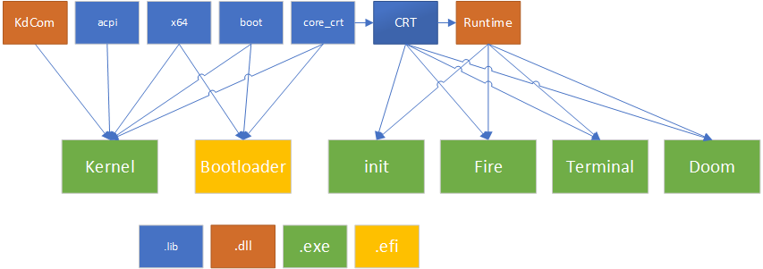
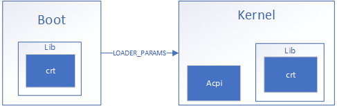
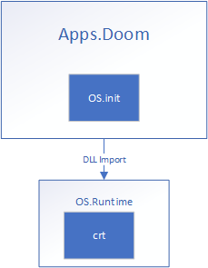
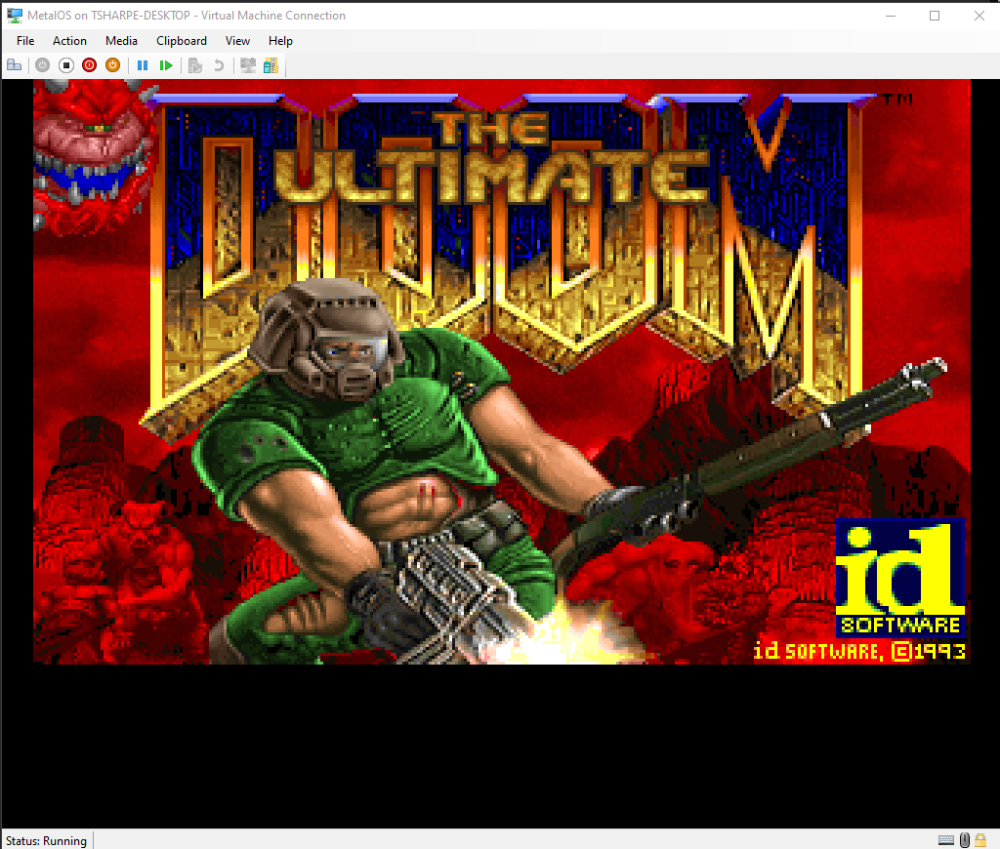
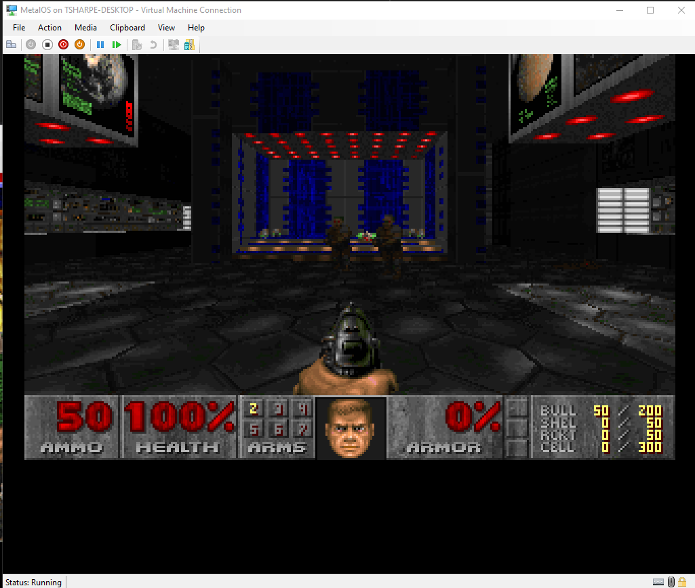
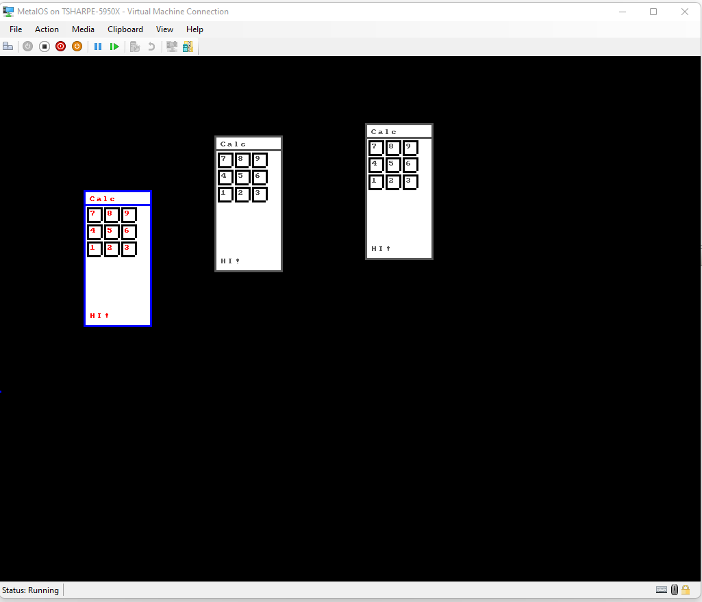
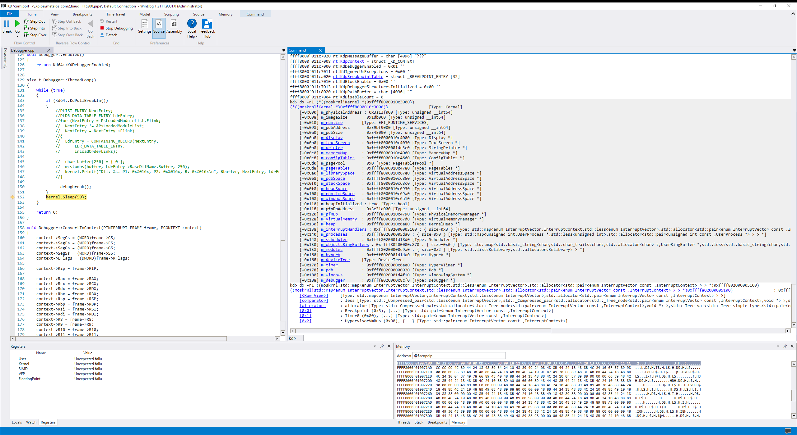

# MetalOS

## Introduction
MetalOS is homebrew operating system for x86-64. It is 64-bit only and has only been tested in Hyper-V Gen2.

## Building
1. Open solution file in VS and build all or open VS 2022 Native x64 command promot and run ``.\scripts\build_solution.cmd``
2. Run ``.\scripts\build_vhd.cmd`` to build ``.\out\MetalOS.vhdx``
3. Create a new VM in ``Hyper-V Manager``, Gen2, reference the build ``vhdx``, disable secure boot.
4. Turn on Com ports:
```
Get-VMComPort -VMName MetalOS
Set-VMComPort -VMName MetalOS -Path \\.\pipe\metalos_com1 -Number 1 
Set-VMComPort -VMName MetalOS -Path \\.\pipe\metalos_com2 -Number 2 
Get-VMComPort -VMName MetalOS
```
5. If theres a weird access error fix ``icacls`` in ``.\scripts\build_vhd.cmd``


### Project Goals
* Run DOOM!
* 48-bit canonical virtual address space (not identity paging)
  * Low half used for Usermode
  * High half used for Kernel mode
* Ring 0 (Kernel) and Ring 3 (User)
* Modern systemcall interface (syscall instruction)

### Non-Goals
* 32-bit compatibility
* Additional architectures
* Support for bios

## Project dependencies


| Project | Type | File | Description |
| - | - | - | - |
| MetalOS.Kernel | Exe | moskrnl.exe | Monolithic kernel |
| MetalOS.Boot | EFI App | BOOTX64.efi | EFI Bootloader |
| MetalOS.Apps.Doom | Exe | doom.exe |  Doom ported for MetalOS |
| MetalOS.OS.Fire | Exe | fire.exe | Doom fire implemented as standalone app |
| MetalOS.OS.Runtime | DLL | mosrt.dll | MetalOS Runtime library |

## Architecture
MetalOS is a monolithic kernel that uses a custom UEFI bootloader:  


Note: All executable formats (``Kernel``, ``Doom``, ``Runtime``, and even ``Boot``) are Microsoft PE files. Boot contains a loader for the Kernel, the Kernel contains a loader for the usermode process (as well as the Runtime) and the Runtime contains a loader for subsequent DLLs the usermode process may desire.

### Boot
The main purpose of Boot is to load the ``Kernel``, however it must also:
* Detect Graphics Device from UEFI (using Graphics Output Protocol)
* Allocate Page Table Pool for Kernel
* Allocate Page Frame Number Database for Kernel's PhysicalMemory
* Allocate and load Kernel's PDB into physical memory (to allow for bugcheck stack walks)

See also: [Loader Params](inc/LoaderParams.h)

### Kernel
Monolithic preemptive kernel. 

Quick Notes:
* UEFI Runtime is mapped into Kernel address space, allowing runtime services to be called
* Each process has at least one thread
* Each user thread also contains a kernel thread for when executing Kernel code (interrupt handler, systemcall)

#### Usermode Interface
Usermode interface is provided by MetalOS.h, a required Init static library, and a single runtime dll.  
  
This dll contains the MetalOS native interface as well as the expected CRT interfaces (stdio, stdlib, string, ctype).

The init library provides two exports for use by the kernel:
* InitProcess
* InitThread

These are the starting entry points for the first thread in a process and subsequent threads, respectively. ``InitProcess`` is responsible for finishing to load the process (and dependencies), executing main, and calling ``ExitProcess`` once main returns. ``InitThread`` retrieves its entry point and calls ``ExitThread`` on its return. ``Init`` depende on ``Runtime`` which means every process running has ``Runtime`` loaded as well.

**Native Interface Subset:**
| Type | Function |
| - | - |
| Environment | GetSystemInfo |
| | GetProcessInfo |
| Process/Thread | Sleep |
| | ExitProcess  |
| | ExitThread |
| File/IO | CreateFile|
| | ReadFile |
| UI  | AllocWindow |
| | PaintWindow |
| | MoveWindow |
| | GetWindowRect |
| | GetMessage |
| | PeekMessage |
| | GetScreenRect |

### Windowing System
Windowing system is implemented in kernel mode, handles composing windows to frame buffer and handling input events.
Currently supports
* Tracking which window has focus
* Click and drag moving of windows

### Features
* Kernel Call Stack (virtual unwind + PDB support) for Assertions/Bugchecks

    IP: 0xffff8000010122c6 Function: ?Bugcheck@Kernel@@QEAAXPEBD00@Z Line: 395  
    IP: 0xffff800001017b3c Function: ?SetScreenBuffer@Kernel@@QEAA?AW4SystemCallResult@@PEAX@Z Line: 173  
    IP: 0xffff800001015383 Function: ?Syscall@Kernel@@QEAA_KPEAUSystemcallFrame@@@Z Line: 899  
    IP: 0xffff80000102e87f Function: SYSTEMCALL_HANDLER Line: 56  
    IP: 0xffff800001039c9c Function: x64_SYSTEMCALL Line: 50  
* Kernel debugging using WinDbg

### 3rd Party code
* ACPCIA
* Virtual Stack Unwinder from coreclr
* kvprintf

### Hyper-V Notes
Gen2 Hyper-V was chosen early into development for its 64-bit UEFI environment (versus the real mode bios booting of Gen1). Gen1 VMs use emulated legacy hardware which allows it to run most operating systems without any modification. However, Gen2 VMs use all synthetic hardware, which requires using the VMBus for access, an entirely undocumented protocol (Guests are required to be aware of Hyper-Vs existence). Drivers used in MetalOS relied heavily on looking at linux driver source (drivers that were written by Microsoft).

- [x] VMBus
- [x] Keyboard
- [x] Mouse (Basics)
- [ ] Video Adapter
- [ ] SCSI
- [ ] Network

## Screenshots

### Doom




### Window System


### WinDBG

Connect with:
```
\\.\pipe\metalos_com2
```
May need to set sympath force kernel symbol:
```
.reload /f /i moskrnl.exe=0xffff800001000000
dx -r1 (*((moskrnl!Kernel *)0xffff8000011cf030))
```

Viewing kernel modules
```
dt moskrnl!KModule 0xffff800001db7258 -l Link.FLink
```

Viewing kernel threads
```
dt -r2 moskrnl!KThread 0xffff8000018b2160 -l Link.FLink
```
Viewing windows:
```
dt moskrnl!UWindow 0xffff8000014b05c0 -l Link.FLink
```

Viewing stack trace:
```
kd> k
 # Child-SP          RetAddr               Call Site
00 ffff8000`20c1f208 ffff8000`0103abc4     nt!ListRemoveEntry+0x2c [C:\Users\todds\GitHub\toddsharpe\MetalOS\src\Lib\List.h @ 47] 
01 ffff8000`20c1f228 ffff8000`0103ecd0     nt!ListRemoveEntry+0x54 [C:\Users\todds\GitHub\toddsharpe\MetalOS\src\Lib\List.h @ 59] 
02 ffff8000`20c1f258 ffff8000`0102edf8     nt!ListHead2<UWindow>::Remove+0x20 [C:\Users\todds\GitHub\toddsharpe\MetalOS\src\Lib\List.h @ 289] 
03 ffff8000`20c1f288 ffff8000`0102ed7a     nt!WindowingSystem::Delete+0x48 [C:\Users\todds\GitHub\toddsharpe\MetalOS\src\kernel\WindowingSystem.cpp @ 63] 
04 ffff8000`20c1f2c8 ffff8000`01042056     nt!Delete+0x1a [C:\Users\todds\GitHub\toddsharpe\MetalOS\src\Kernel\Kernel.cpp @ 848] 
05 ffff8000`20c1f2f8 ffff8000`0103a3d9     nt!CloseHandle+0x76 [C:\Users\todds\GitHub\toddsharpe\MetalOS\src\kernel\Syscalls.cpp @ 795] 
06 ffff8000`20c1f348 ffff8000`01042970     nt!KeTerminateProcess+0x59 [C:\Users\todds\GitHub\toddsharpe\MetalOS\src\Kernel\Kernel.cpp @ 507] 
07 ffff8000`20c1f388 ffff8000`0102f278     nt!ExitProcess+0x20 [C:\Users\todds\GitHub\toddsharpe\MetalOS\src\kernel\Syscalls.cpp @ 395] 
08 ffff8000`20c1f3c8 ffff8000`010434e3     nt!Dispatch+0x2c8 [C:\Users\todds\GitHub\toddsharpe\MetalOS\src\kernel\Syscalls.cpp @ 99] 
09 ffff8000`20c1f418 ffff8000`01047622     nt!KeSyscall+0x13 [C:\Users\todds\GitHub\toddsharpe\MetalOS\src\kernel\Syscalls.cpp @ 199] 
0a ffff8000`20c1f458 ffff8000`20c1f478     nt!x64_SYSTEMCALL+0x4f
0b ffff8000`20c1f460 ffff8000`010280b3     0xffff8000`20c1f478
0c ffff8000`20c1f468 00000000`00000000     nt!ListForEach<KThread,unsigned __int64>+0x73 [C:\Users\todds\GitHub\toddsharpe\MetalOS\src\Lib\List.h @ 140] 
```
