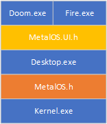

# Desktop

## Architecture

## MetalOS.h - Kernel API
Basic goal here is to provide both Video/Input (Keyboard/Mouse). Every kernel UserThread has a message queue.
* CreateDesktop - pixel size, color masks, height/width, creates message queue
* SetScreenBuffer
* GetMessage
* PeekMessage

## MetalOS.UI.h - UI API (Native)
* CreateWindow
* GetWindowRect